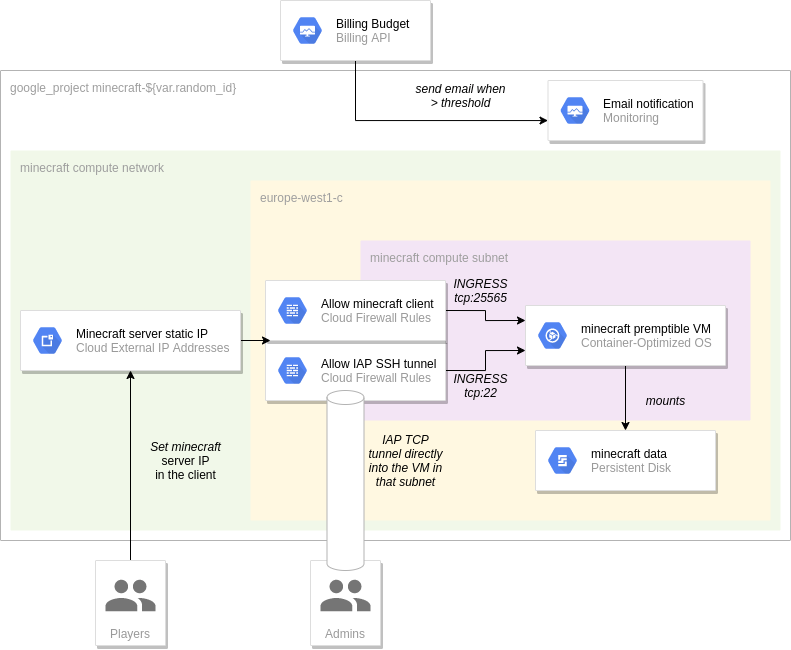
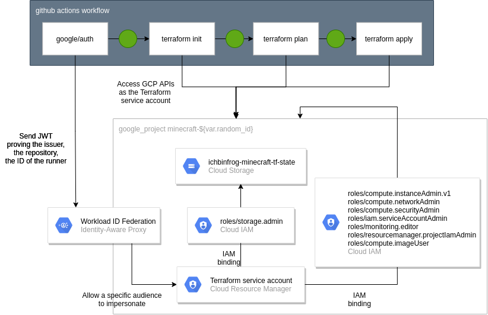

# Terraforming Minecraft for GCP

[](https://github.com/ichbinfrog/minecraft/actions/workflows/tfplan.yml)

> This repo stores terraform codes (and the github actions workflow) that automates a deployment of a Minecraft server (with static IP) on GCE and the related IAM permissions. Some manual steps to set up the CICD pipeline is described in the bootstrap/ folder.

## Overview

### Core



In relation to the minecraft server, this repo creates:
- A preemptible GCE VM with Container Optimized OS on which the [itzg/docker-minecraft-server](https://github.com/itzg/docker-minecraft-server) image is run
- A `PREMIUM` static IP adress from which the users can connect to the server
- A persistent disk in which the minecraft data will be stored (without backup for cost reduction)
- A compute network and a single subnet in a specific region to which firewall rules are added which only allow the minecraft client ports (from any range) and SSH connections from the IAP source ranges
- A bugdet monitor with the appropriate notification channel to avoid [this kind of situation](https://www.reddit.com/r/aws/comments/g1ve18/i_am_charged_60k_on_aws_without_using_anything/)

### CICD pipeline



In relation to automating the above infrastructure release process, this repo creates:
- A terraform service account with elevated privileges within the cluster (on one hand, it's recommended to use a separate CI user from a security perspective, on the other hand, it's also required to use impersonation and not an user account for certain APIs, e.g. billing)
- Create a Workload Identity Federation between Github and GCP to allow keyless authentication (cf. [doc](https://cloud.google.com/blog/products/identity-security/enabling-keyless-authentication-from-github-actions))

## Spin up

A manual step is required to be run locally on the owner's PC with the following requirements

- `terraform` and `gcloud` commands.
- The user running terraform must be authenticated with the [Application Default Credentials](https://cloud.google.com/sdk/docs/authorizing)
- The billing account must be created and linked to a valid payment service manually

1. Define variables in `bootstrap/terraform.tfvars` 

2. Run `terraform -chdir=bootstrap apply` locally

3. Since the state is enabled locally, it will need to be migrated to the recently created bucket. Uncomment the gcs backend in `bootstrap/terraform.tf` and run `terraform -chdir=bootstrap apply` 

4. Update the `terraform.tfvars` and `terraform.tf` with appropriate values.

5. Enable Github Actions. Now every merge to master will run the apply and every PR will create a plan for review.

## Accessing the minecraft server

Once the pipeline has completed, admins can ssh through an iap tunnel to the GCE instance with
```shell
gcloud compute ssh $INSTANCE \
    --project=$PROJECT_ID \
    --tunnel-through-iap \
    --zone=$ZONE
```

Then managing and whitelisting players can be done following [this tutorial](https://github.com/itzg/docker-minecraft-server#whitelist-players).
